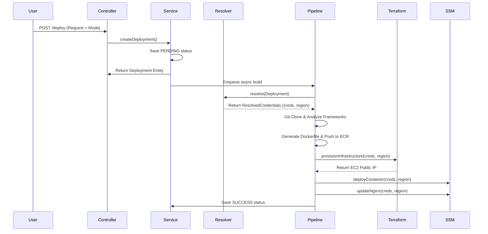
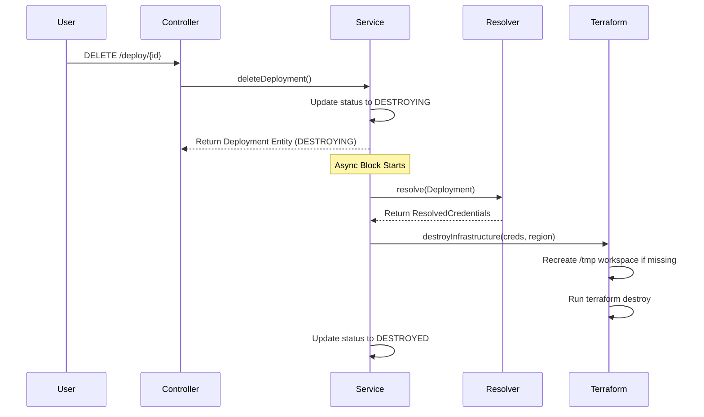

# Autopilot Backend Changes & Technical Architecture

This document explains the modifications, refactorings, and features implemented in the Autopilot backend to support **Managed Mode**, **BYOC (Bring Your Own Cloud) credentials routing**, **Secure Lifecycle Management (Resource Destruction)**, and general pipeline stability.

---

## 1. Core Architecture Changes

### A. Dynamic AWS Credential Routing
Previously, AWS services assumed roles or accessed AWS credentials in a scattered, hardcoded manner. We introduced `CredentialResolverService` to centralize this routing.
- **MANAGED Mode**: If a platform-wide IAM role ARN is configured, the resolver assumes it via STS. If the platform role is left empty, the system automatically falls back to local system credentials (IMDS instance profiles, environment variables, or local profile files). This allows developers to test locally without configuring IAM role assumption.
- **BYOC Mode**: The resolver uses the customer's provided `awsRoleArn` to assume a role via STS, generating temporary credentials valid for 1 hour.

All downstream services (`RdsProvisioningService`, `SecretsManagerService`, `DockerPushService`, `TerraformService`, and `SSMDeployService`) now accept a resolved `AwsCredentialsDto` rather than handling role assumption themselves.

### B. Deployment Lifecycle & Automated Teardown
To manage active resources and prevent billing leaks, we introduced resource destruction:
1. **Lifecycle States**: Added `DESTROYING` and `DESTROYED` to the `DeploymentStatus` enum.
2. **Secure Endpoint**: Added `DELETE /deploy/{id}` inside `DeploymentController` (secured under OAuth/JWT validation).
3. **Asynchronous Teardown**: The controller updates the database status to `DESTROYING` and returns immediately. In the background, it resolves the original credentials and calls Terraform to execute `terraform destroy -auto-approve`.
4. **Workspace Recovery**: If the target workspace directory in `/tmp` was deleted (e.g., due to a reboot or file system cleanup), the engine automatically recreates the directory, copies the Terraform templates from resources, writes the matching `terraform.tfvars`, runs `terraform init`, and executes `destroy`.

---

## 2. File-by-File Details

### 📂 Security & Configuration
#### 1. `SecurityConfig.java`
- Removed `/deploy/**` from the `permitAll()` list. Deployment creation, listing, and deletion now require valid JWT authentication.
- Permitted `/deploy/*/logs/stream` for public SSE transport because standard browser `EventSource` cannot customize headers. The custom `JwtAuthFilter` checks the JWT token passed as a query parameter (`?token=`) for authentication.

#### 2. `OAuth2SuccessHandler.java`
- Configured frontend redirects post-authorization to send tokens securely.

#### 3. `application.properties`
- Added configuration templates for managed mode (`autopilot.platform.role-arn` and `autopilot.platform.region`).

---

### 📂 Controllers & Entities
#### 4. `DeploymentController.java`
- Added the `DELETE /deploy/{id}` mapping that delegates to `DeploymentService.deleteDeployment(id, user)`.
- Enforces strict tenancy checking—a user can only delete or fetch their own deployments.

#### 5. `Deployment.java` & `DeployRequest.java`
- Added `deploymentMode` (MANAGED or BYOC), `awsRoleArn`, and `awsRegion` fields to persist routing configuration.

#### 6. `DeploymentStatus.java`
- Added `DESTROYING` and `DESTROYED` enum values.

---

### 📂 Core Services
#### 7. `CredentialResolverService.java` (New)
- Dynamically resolves deployment parameters.
- Returns a `ResolvedCredentials` record containing `AwsCredentialsDto`, the target region, the assumed ARN, and an `isAssumedRole` indicator.

#### 8. `DeploymentService.java` & `DeploymentServiceInterface.java`
- Added input validation for `deploymentMode` and formatting checks for `awsRoleArn` (e.g., `arn:aws:iam::<account-id>:role/<role-name>`).
- Implemented `deleteDeployment` which runs `terraformService.destroyInfrastructure` in a background thread using `CompletableFuture.runAsync()`.

#### 9. `DeploymentPipelineService.java`
- Injected `CredentialResolverService` to dynamically resolve target session credentials before starting cloning, building, provisioning, or deployment.
- Fixed a JDK compilation error related to lambda variable scope (ensured variables referenced in Lambdas are effectively final).
- Fixed a potential git-clone subprocess deadlock by asynchronously draining standard error/output streams during repository cloning.

#### 10. `FrontendPatcherService.java`
- Scans frontend source files (`.js`, `.ts`, `.jsx`, `.tsx`, `.env`, `.json`) to search for and replace hardcoded localhost backend URLs (e.g. `http://localhost:8080`) with the live backend proxy URL.

---

### 📂 AWS & Infrastructure Services
#### 11. `TerraformService.java`
- Decoupled AWS role assumptions. Replaced raw credential checks with incoming `AwsCredentialsDto`.
- Updated variable configuration generation to write empty strings if credentials are not provided (instructing Terraform to fall back to the default AWS credentials chain).
- Implemented `destroyInfrastructure` to recreate workspace templates and execute `terraform destroy -auto-approve` safely.
- Mapped regional Ubuntu 22.04 LTS AMIs across 8 regions (`ap-south-1`, `us-east-1`, etc.).

#### 12. `DependencyProvisionService.java`
- Wired resolved credentials through RDS provisioning and Secrets Manager storage.
- Standardized database connection string generation (MySQL/PostgreSQL) and wildcarded CORS constraints automatically.

#### 13. `DockerPushService.java`, `RdsProvisioningService.java`, `SecretsManagerService.java`
- Modified to accept `AwsCredentialsDto` and build client builders dynamically. If the DTO is null, the AWS client builders fall back to the standard SDK Default Credential Provider Chain.

#### 14. `SSMDeployService.java`
- Configured SSM deployment actions (`deployContainer`, `updateNginx`) to use dynamically resolved AWS clients.

#### 15. `src/main/resources/terraform/main.tf`
- Configured AWS providers to check if access keys or session tokens are empty string, mapping them to `null` to ensure the provider delegates authentication to the local EC2 instance profile or local configurations.

---

## 3. Operational Flow Reference

### 🚀 1. The Deployment Flow

### 🧹 2. The Destruction Flow

